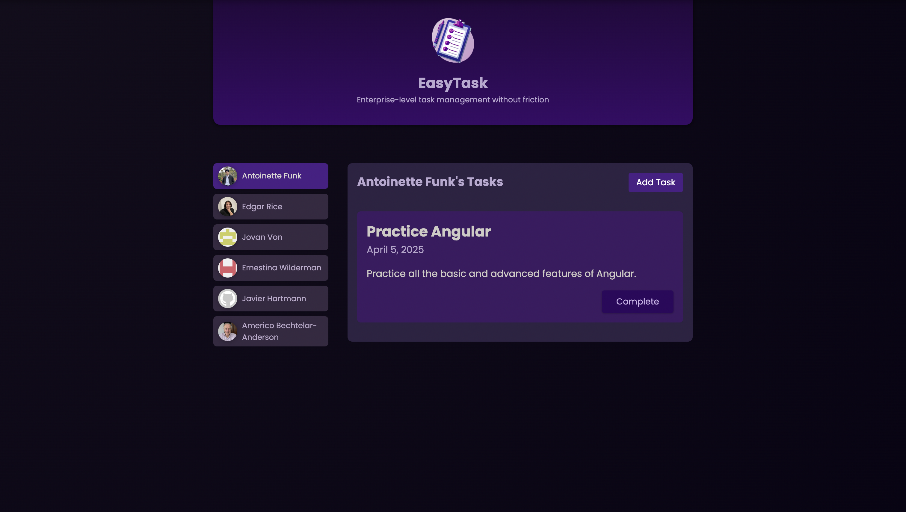

# EasyTask

A task management app built with Angular, designed to allow multiple users to efficiently manage their tasks. It integrates local storage for data handling and was created for educational purposes. The app features a clean, modern interface that ensures an intuitive and enjoyable task management experience.

## Technologies used
* HTML5
* CSS3
* Angular
* TypeScript
* Faker API
* Git

## Instructions for Working with the Project

	1. Open your terminal and run the following command to clone the repository:
    
        git clone https://github.com/modeltoIT/easy-task.git
    
    2. Move into the project directory:

        cd easy-task
    
    3. Ensure that Node.js version v20.x.x is installed. Verify this by running:
    
        node -v
    
        If the version is incorrect, install or update Node.js from Node.js official website.
        
    4. Install the necessary project dependencies by running:
    
        npm install

    5. Start the development server with the command:

        npm start

## View Project

Live Demo: [View the Project](https://modeltoit.github.io/easy-task/)

## Preview

